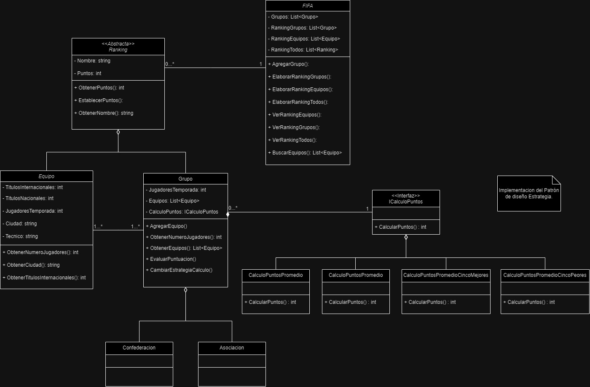

# FIFA_Ranking

Para visualizar implementación detallada de cada uno de los modelos en C#de todos los requerimientos, visualizar y ejecutar el archivo `Program.cs` para ver una demostración por consola; dentro de la carpeta `Models` se encuentra cada una de las clases del modelo.

La solución que utiliza POO se muestra en el modelo encontrado en el archivo `ClassModel.jpg` como vemos a continuación:



---

### Historias de usuario

- **Incorporar Nuevos Grupos de Equipos:** para realizar esta incorporación al igual que con las clases Confederación y Asociación basta con crear la clase y heredar de la clase `Grupo` **, de ser necesario agregar las implementaciones específicas de la nueva clase. De esta manera también se respetan los principios SOLID.**
- **Cambiar Caluculo Puntaje Grupos:** Los grupos ya sean Confederaciones o Asociaciones o cualquier otro grupo creado tiene por default el calculo de los puntos con el promedio del puntaje de sus equipos asociados. Para realizar el cambio de este cálculo de puntos en tiempo de ejecución se hace uso de un patrón de diseño Estrategia y basta con reasignar el tipo de estrategia de cálculo al grupo.
    
    ```csharp
    CONMEBOL.CambiarEstrategiaCalculo(new CalculoPuntosSumaTotal());
    UEFA.CambiarEstrategiaCalculo(new CalculoPuntosPromedioCincoMejores());
    CONCACAF.CambiarEstrategiaCalculo(new CalculoPuntosPromedioCincoPeores());
    ```
    
    Para crear un nuevo tipo de cálculo sólo es necesario crear una nueva clase que implemente la interfaz `ICalculoPuntos` e implementar el método de esta misma.
    
- **Rankings:** Para visualizar cada uno de los rankings luego de haber agregado los grupos a la instancia de la clase `FIFA` que en este caso actúa como un Singleton (única clase), se puede ejecutar la visualización de los rankings via:
    
    ```csharp
    FIFA fifa = new FIFA();
    fifa.AgregarGrupo(UEFA);
    fifa.AgregarGrupo(CONMEBOL);
    fifa.AgregarGrupo(CONCACAF);
    
    fifa.VerRankingEquipos();
    
    fifa.VerRankingGrupos();
    
    fifa.VerRankingTodos();
    ```
    
    Se ha implementado una segregación de ranking sólo para grupos, sólo para equipos y un ranking general en donde se pueden comparar tanto grupos como equipos y para el caso de los grupos su puntuación ha sido calculada con la estrategia propia que tenga definida.
    
- **Busqueda de equipos:** La búsqueda de equipos corresponde a la clase `FIFA` y va a realizar la búsqueda sobre los equipos de los grupos que se le han agregado previamente, para ello se construyó una función que posee cuatro parámetros de acuerdo con los cuatro tipos de filtros solicitados:
    
    ```csharp
    public List<Equipo> BuscarEquipos(bool masDe17Jugadores, string ciudad, bool masDeUnTituloInternacional,  bool masDeDiezTitulosInternacionales)
    ```
    
    1. Buscar los equipos que usaron más de 17 jugadores (bool masDe17Jugadores)
    2. Equipos de una determinada ciudad (string ciudad) 
    3. Equipos que tengan al menos un título internacional (bool masDeUnTituloInternacional)
    4. equipo que tengan al menos 10 títulos internaciones (bool masDeDiezTitulosInternacionales)
    
    Por ejemplo, para obtener los equipos de la ciudad de “Buenos Aires” y que tengan más de 10 títulos internacionales se utiliza:
    
    ```csharp
    List<Equipo> equiposFiltrados = fifa.BuscarEquipos(false, "Buenos Aires", true, true);
    ```
    
- **Demás servicios de obtención de propiedades:** Los demás servicios requeridos se implementan como se muestra a continuación:
    
    ```csharp
    // Obtener la cantidad de jugadores de un equipo.
    RealMadrid.ObtenerNumeroJugadores();
    
    // Obtener la cantidad de jugadores de una asociación o confederación (suma de los
    // jugadores de cada equipo).
    UEFA.ObtenerNumeroJugadores();
    
    //Obtener la cantidad de jugadores de un grupo (suma de los jugadores de cada equipo).
    Grupo.ObtenerNumeroJugadores();
    
    //Obtener todos los equipos de una confederación o asociación.
    UEFA.ObtenerEquipos();
    
    //Obtener todos los equipos de un grupo.
    Grupo.ObtenerEquipos();
    ```